# Курсовая работа на профессии "DevOps-инженер с нуля"
## Исполнитель: Файзиев Давлат

Текст курсовой находится по [ссылке](https://github.com/netology-code/fops-sysadm-diplom/blob/diplom-zabbix/README.md).

Доступ к ресурсам:
- [Application Load Balancer](http://158.160.138.78/)
- [Kibana](http://84.201.159.220:5601/)
- [Zabbix server](http://158.160.110.86/) (логин/пароль - по умолчанию)


Для развертывания и конфигурации инфраструктуры используется Terraform и Ansible.
Проект курсовой работы состоит из двух папок:
- terraform (содержит манифесты для развертывания и резервного копирования инфраструктуры);
- ansible (содержит плейбуки для конфигурации инфраструктуры).

### Развертывание инфраструктуры:

До начала запуска необходимо создать yandex_cloud_token.
Прописать токен в качестве переменной в файле terraform.tfvars. Файл разместить в папке terraform.  
Далее из папки terraform выполняем команды:
```sh
terraform init
terraform apply -target=module.vpc_up --auto-approve
```

#### Результат работы команды:


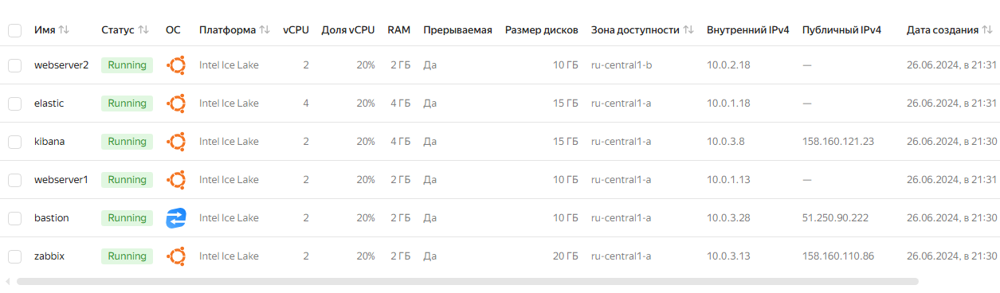

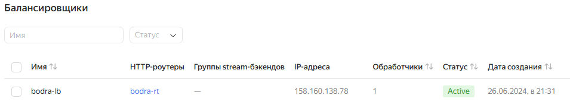

### Настраиваем Elasticsearch и Kibana:

1. Редактируем файл inventory.ini.  
Необходимо в разделе all:vars прописать внешние ip-адреса для bastion и zabbix, полученные при запуске манифеста terraform:

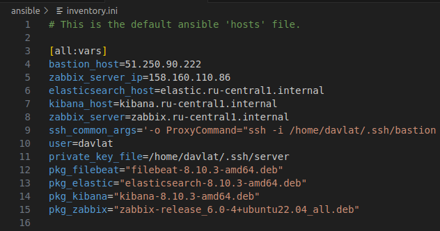

2. Запускаем плейбук 1_conf_elk.yml из директории ansible.
```sh
ansible-playbook 1_conf_elk.yml 
```
В результате работы плейбука будет настроено:
- сервер elasticsearch
- сервер kibana
- связь между ними

#### Результат работы команды:

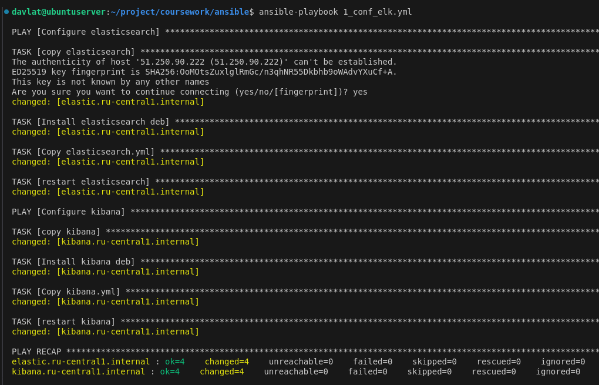

### Настраиваем веб сервера:

Запускаем плейбук 2_conf_web.yml из директории ansible.
```sh
ansible-playbook 2_conf_web.yml
```
В результате работы плейбука будет настроено:
- веб сервер nginx
- веб страница index.html
- filebeat на отправку access.log, error.log nginx

#### Результат работы команды:

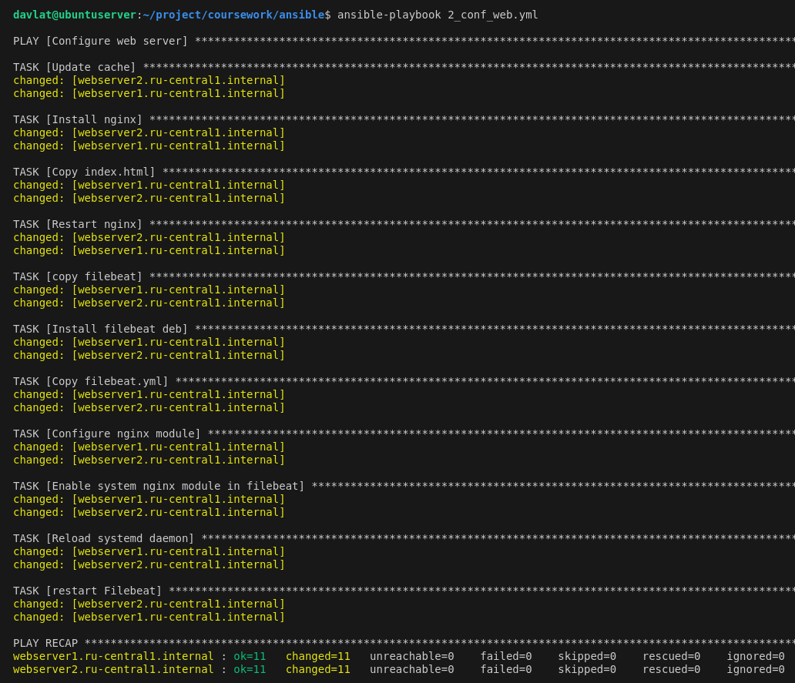

### Настраиваем сервер Zabbix и zabbix agent:

Запускаем плейбук 3_conf_zabbix.yml из директории ansible.
```sh
ansible-playbook 3_conf_zabbix.yml
```
В результате работы плейбука будет настроено:
- сервер Zabbix
- установлен zabbix agent на вебсервера

#### Результат работы команды:

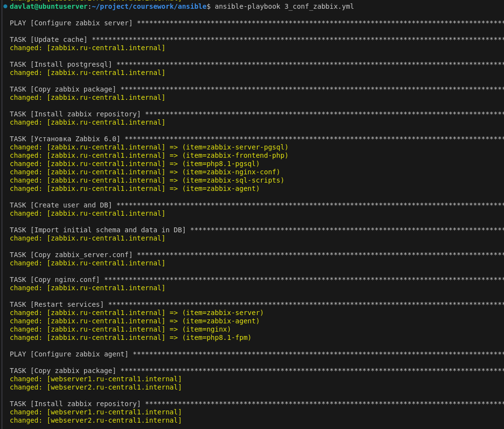
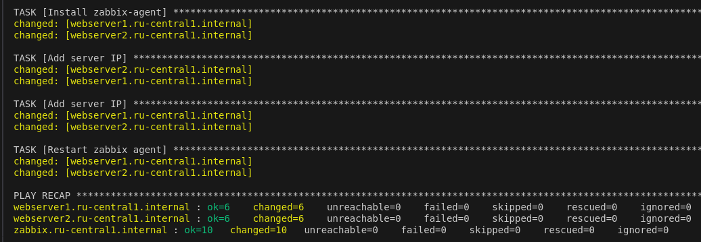

### Проверяем инфраструктуру:

#### Балансировщик и доступность сайта:

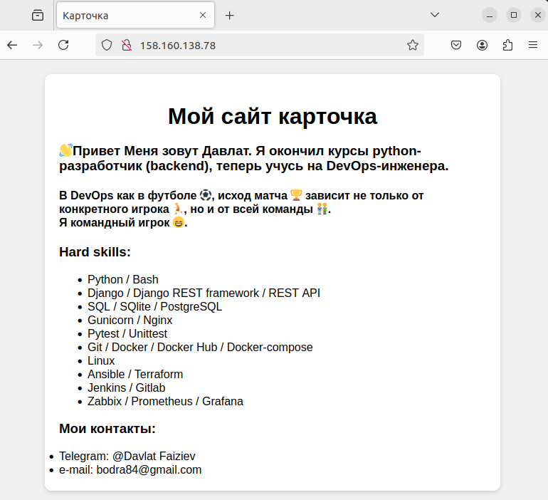

#### Поступление логов на сервер kibana:

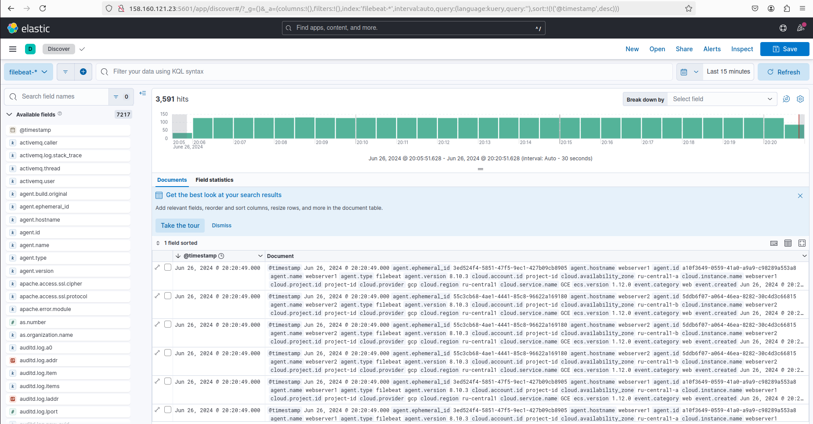

### Мониторинг в Zabbix:

Хосты:

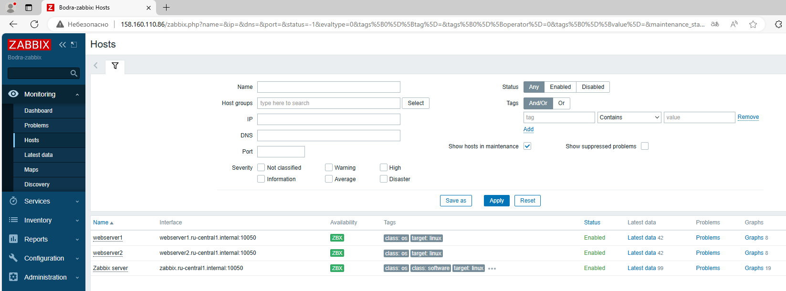

Дешборды:

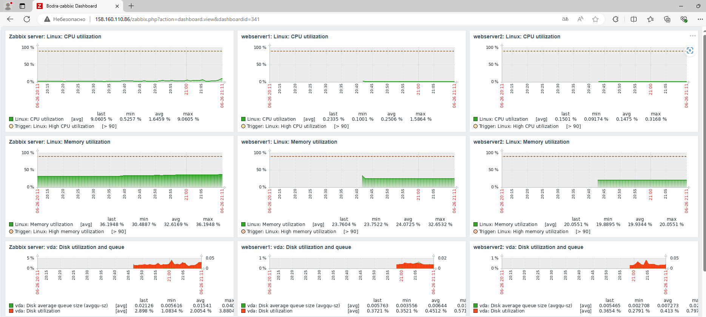
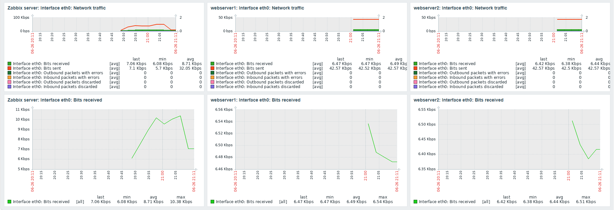

### Резервное копирование:
После того как все сконфигурировано, необходимо сделать резервные копии дисков всех виртуальных машин. 

Для этого из папки terraform выполняем команду:
```sh
terraform apply -target=module.image_bkup --auto-approve
```
#### Результат работы команды:

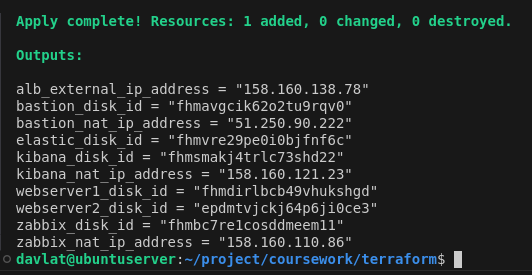

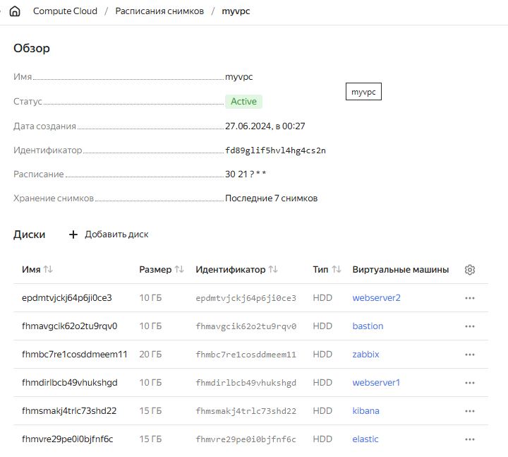

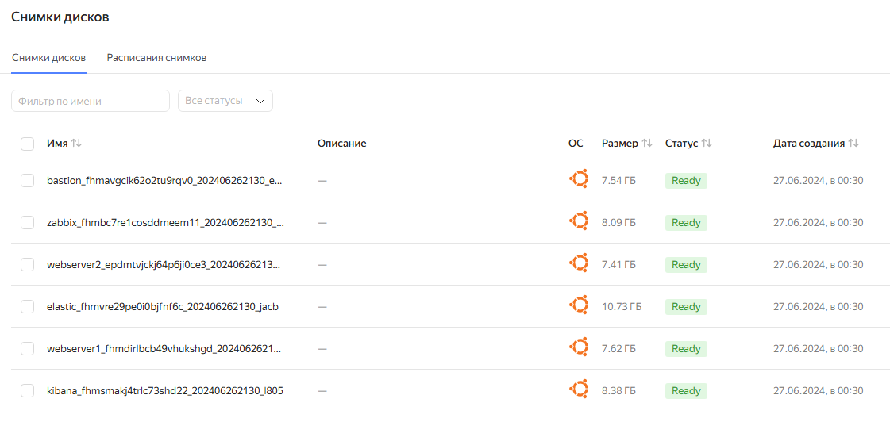

