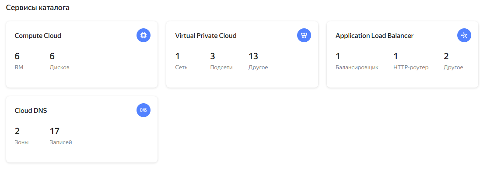

# Курсовая работа на профессии "DevOps-инженер с нуля"
## Исполнитель: Файзиев Давлат
Текст курсовой находится по [ссылке](https://github.com/netology-code/fops-sysadm-diplom/blob/diplom-zabbix/README.md).

Для развертывания и конфигурации инфраструктуры используется Terraform и Ansible.
Проект курсовой работы состоит из двух папок:
- terraform (содержит манифесты для развертывания и резервного копирования инфраструктуры);
- ansible (содержит плейбуки для конфигурации инфраструктуры).

### Развертывание инфраструктуры:
До начала запуска необходимо создать yandex_cloud_token и прописать его в качестве переменной в файле terraform.tfvars.  
Из папки terraform выполнить команды:
```sh
terraform init
terraform apply -target=module.vpc_up --auto-approve
```

Результат работы команды:


  

